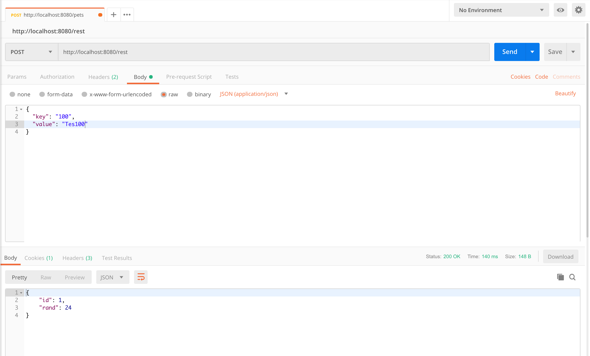
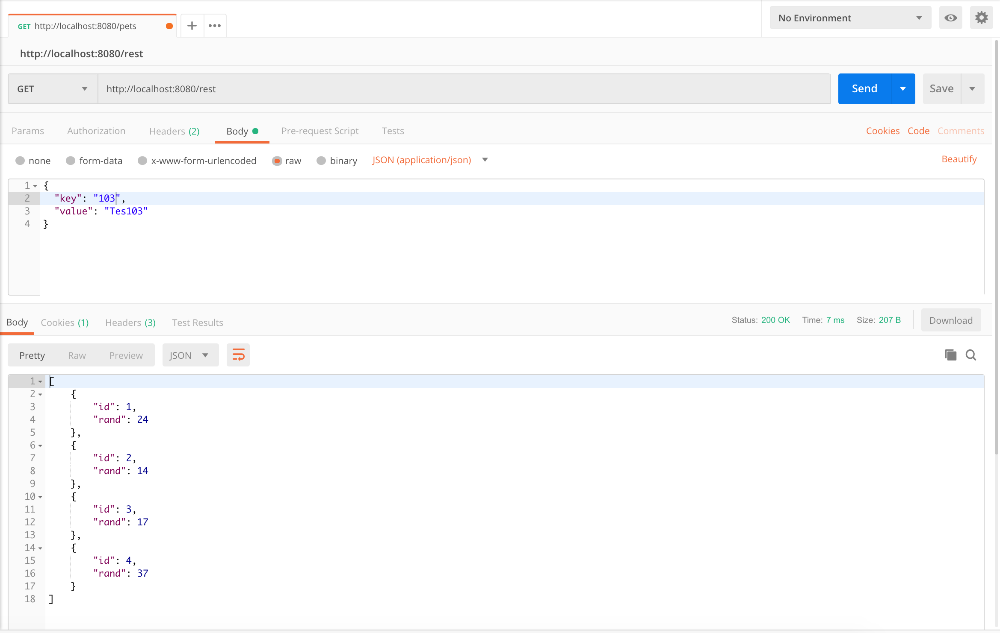
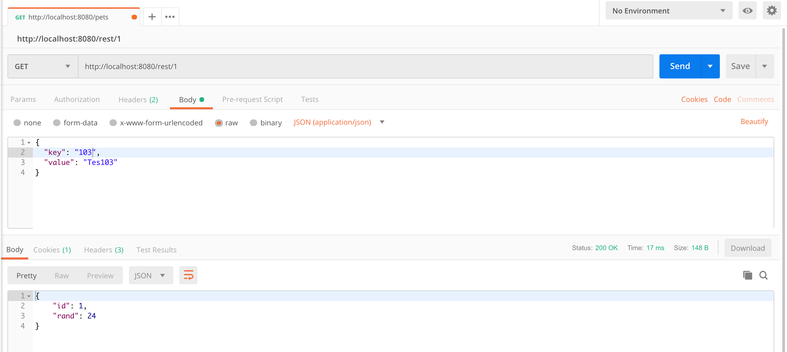
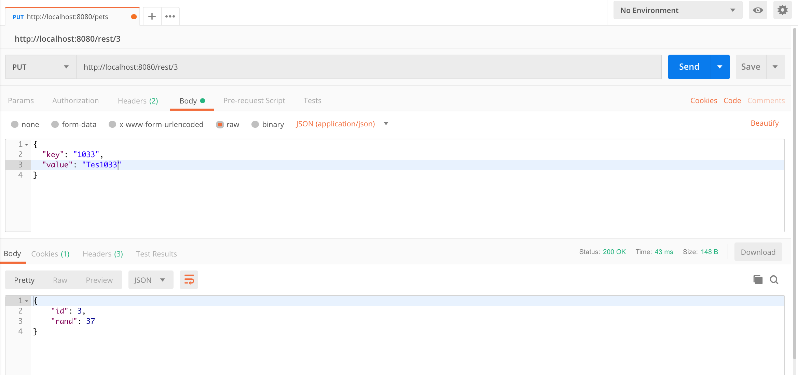
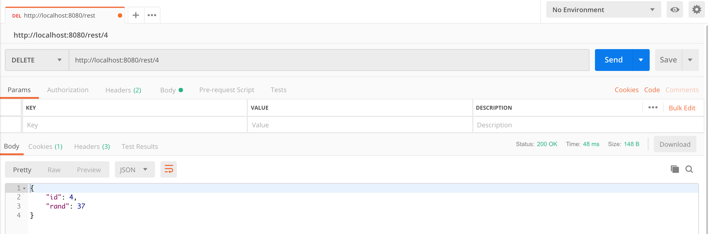

# springboot-jdbc-postgres

#### Run this project by these commands :
1. `git clone https://github.com/KominfoPemudaPersis/springboot-jdbc-postgres.git`
2. `cd springboot-jdbc-postgres`
3. Change `application.properties` by your postgres configuration
4. Run this `mvn clean spring-boot:run`

#### Screen shot
Add New Data

Get All Data

Get Data By Id

Update Data

Delete Data

